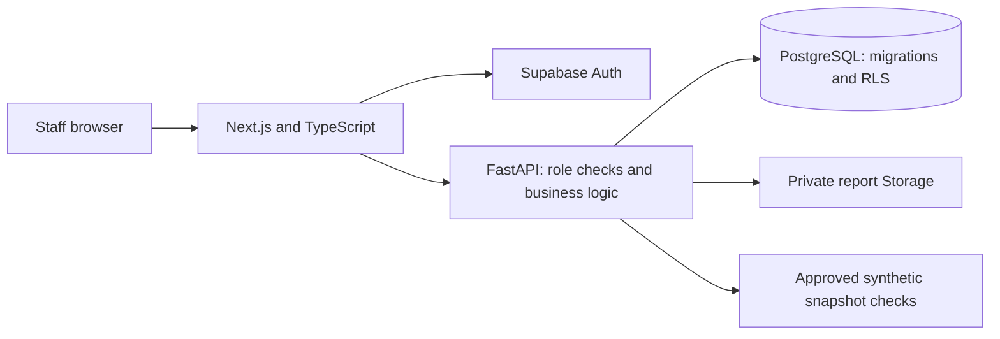

# Week 4 Day 20 Architecture and Operations

Date: 24-09-2026
Branch: `feature/week4-day20-final-handover`

## Runtime and ownership

Backend/data owner maintains Python 3.12, FastAPI, Pydantic schemas, scoring, reports,
SQL migrations, RLS and pytest. Frontend/product owner maintains Next.js, TypeScript,
Tailwind, shadcn-style components, accessibility and Playwright/Vitest. XY CYBER's
receiving maintainer must assign named owners and a reviewer after transfer; no
individual assignment or supervisor acceptance is implied by this document.

With `DATABASE_URL`, business records persist in PostgreSQL. Without it, isolated
backend tests use memory; this fallback is not the handover runtime. `AUTH_MODE=supabase`
verifies sessions through Auth and checks active profiles. Local development tokens
are for backend tests only. The frontend never receives the service-role key.

Report generation assembles escaped HTML, converts it to a lightweight text PDF,
uploads a private object and stores its metadata. The database enforces the ordered
workflow. Only Admin/Management can approve and download an approved report. SQL seeds
CRM/scans; `python -m app.seed_reports` completes actual PDF fixtures after Storage starts.

## Dependencies and configuration

Exact dependencies: `backend/requirements.txt`, `backend/requirements-dev.txt`,
`frontend/package.json` and `frontend/package-lock.json`. Install Python 3.12, Node LTS,
Git and Docker Desktop. Use the root README's pinned Supabase CLI commands.

| Variable | Purpose | Exposure |
| --- | --- | --- |
| APP_ENV | `local` for synthetic report seeding | Server |
| AUTH_MODE | `supabase` for application; `local` for isolated tests | Server |
| DATABASE_URL | Local PostgreSQL connection from CLI status | Secret, server only |
| SUPABASE_DB_URL | RLS/seed integration test connection | Secret, test process only |
| SUPABASE_URL | Local Auth/Storage API URL | Server |
| SUPABASE_ANON_KEY | Auth public client key | Local environment |
| SUPABASE_SERVICE_ROLE_KEY | Private Storage and staff administration | Secret, server only |
| NEXT_PUBLIC_API_BASE_URL | Browser FastAPI URL | Public |
| NEXT_PUBLIC_SUPABASE_URL | Browser Auth URL | Public |
| NEXT_PUBLIC_SUPABASE_ANON_KEY | Public Auth client key | Public; never use service key |
| CORS_ORIGINS | Explicit frontend origins | Server |
| LOG_LEVEL | Structured request logging level | Server |
| DEMO_PASSWORD | Existing synthetic local account password for live tests | Test process only |
| PLAYWRIGHT_CHANNEL | Optional installed browser, e.g. `msedge` | Test process only |

Values belong in ignored environment files or the active process, not this document.
API contract: `docs/api-contract.md`; interactive OpenAPI: `http://localhost:8000/docs`.

## Run, verify and stop

Follow root README from a clean clone. Reset only a disposable local database during
initial installation. Normal startup preserves notes and CRM records. Apply all tracked
migrations before starting the app. Do not run two Next.js development/build processes
against the same checkout: they share `.next` and can invalidate each other's chunks.

From backend/: `python -m pytest` and `python -m ruff check .`.
From frontend/: `npm.cmd run typecheck`, `npm.cmd run lint`, `npm.cmd test`,
`npm.cmd run build`, and `npm.cmd run test:responsive`.
Install a test browser with `npx.cmd playwright install chromium`, or set
`PLAYWRIGHT_CHANNEL=msedge` to use installed Edge for responsive tests. Use installed
Chrome (`PLAYWRIGHT_CHANNEL=chrome`) for the live download suite in this environment.
With both app services running and
`DEMO_PASSWORD` supplied in the shell, run `npx.cmd playwright test --config playwright.live.config.ts`.
Live tests add uniquely named synthetic records; they never reset the database.
Traces are disabled for live tests so bearer tokens are not retained in artifacts.

Stop directly launched processes with Ctrl+C; `docker compose down` stops Compose;
`npx.cmd --yes supabase@2.115.0 stop` preserves local Supabase data. Never use volume
removal or db reset as a routine restart.

## Transfer and rollback

Transfer repository access, tagged source, lockfiles, documentation and synthetic
artifacts. Provision receiver-owned secrets separately. Review PRs before merging.
No hosted resources, ownership changes, external report sending or production launch
are part of this handover. Back up local data before migration/reseed work.

This change adds no schema migration. To roll back app changes, check out the prior
reviewed tag/commit and reinstall its dependencies. Existing real PDF objects remain
private. Avoid rerunning Day 19's obsolete placeholder report SQL. Missing objects
are treated as errors rather than silently represented as successful seeds.
